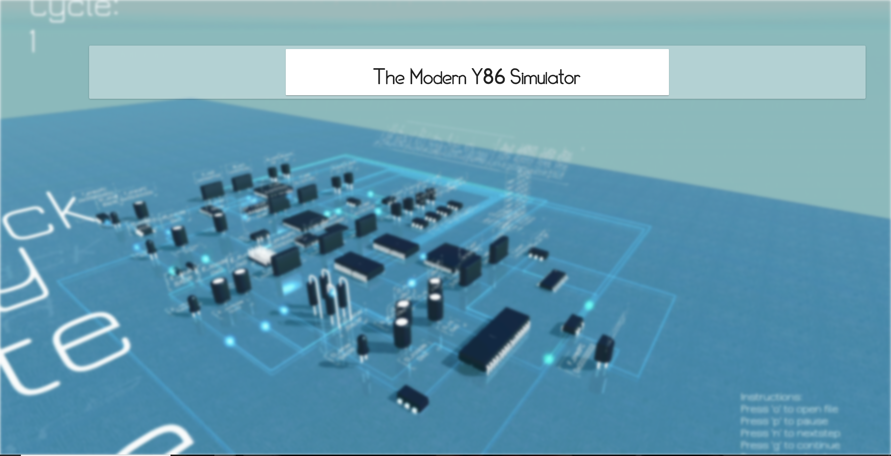
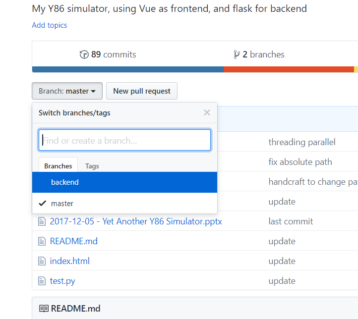
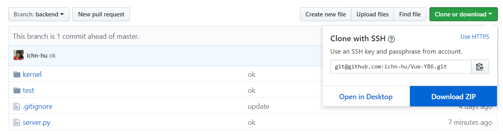
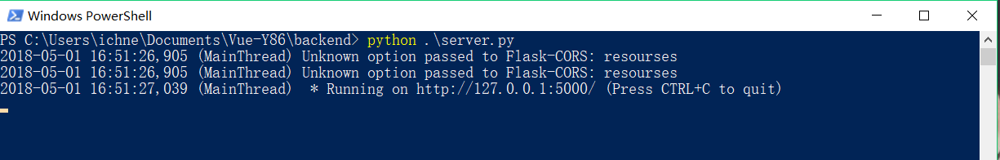
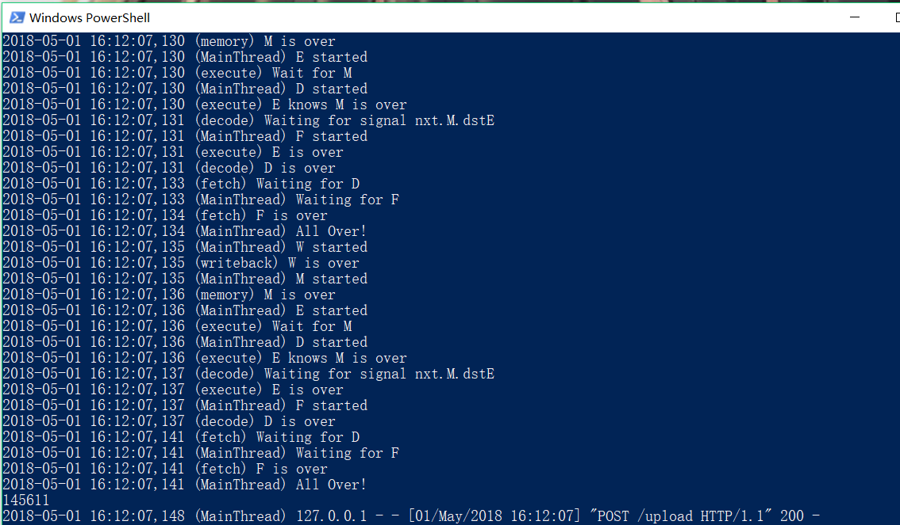
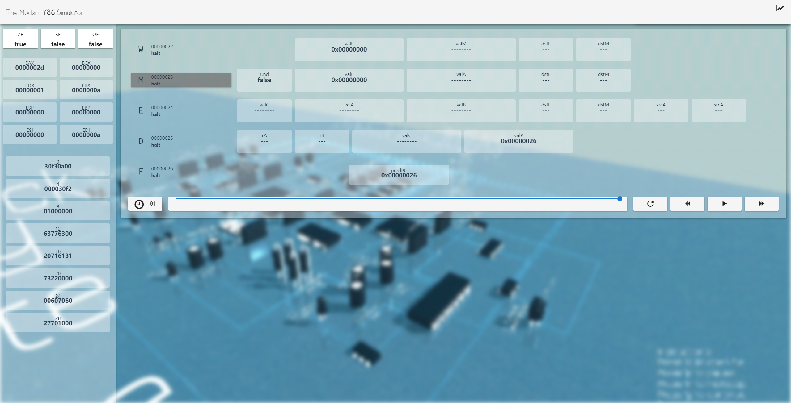

Y86 Simulator, for ICS2017 @ Fudan University, by ichn-hu

## Animated Illustration

<del>To be recorded.</del>

Now available at [[bilibili]](https://www.bilibili.com/video/av22848850/).

## How to play

* The vue-built frontend is now available at [the github page](http://ichn-hu.github.io/Vue-Y86). For visual effects, this frontend interface was designed with love and several large static files, so please make sure the web page is fully loaded for further operation. Once the page is fully loaded, the browse will cache these large file, and the pain of loading it will disappear! The change of the font of the title is a signal of fully loaded. Take your time~😋

* Then you can checkout the `backend` branch and down load it to your local environment, because the frontend is already available, for the sake of your disk space and time you don't have to download and rebuild it (which requires node.js environment). ✨

  

  


* The backend is written in python3, and the only dependence is the `flask` package. Make sure your python is compatible with the requirement. 😀 In the root directory, run `python server.py` then you will have the backend available at `localhost:5000`. The web front will interact with the backend through it, more precisely, post the uploaded `.yo` Y86 binary file to the backend, and wait for the response containing all the inner states during executing the instructions, and then rendering it.
  

* Now let's play. In the `test` director, there are a bunch of `.yo` files that can be tested. Drag and drop one of then into the github page web front, the backend will output the inner threading details to the terminal you run it. Once the execution is done, the front page will change to the display model for you to check and play with.
  

  ​


## Parallel Execution

The repo is updated for compatibility for parallel execution. Besides additional files, the change to the original code is minimal. If you want to roll back to serialized execution, you can change the [line](https://github.com/ichn-hu/Vue-Y86/blob/ff2d6df3671773c90bda74158f23aac216cbe1c8/backend/kernel/runner.py#L2) to

```pytho
# import kernel.cpu_parallel as cpu
import kernel.cpu as cpu
```

By default, enabled by python's `threading` library, the code runs in parallel.

## Backend Code Explanation

Written in python, the backend code is organized in a hierarchical structure. Where the `server.py` serves as the interface, and the `kernel/` directory contains the core of the simulator. Since the pipeline contains five stages, this theoretical abstraction is reflected by physical file organization. In the directory `kernel/stages` or `kernel/parallel_stages`, operations of each stage are split to five individual python files. In the `kernel/`, `cpu.py` or `cpu_parallel.py`(which will be discussed later) controls the whole execution, and `memory.py` ,`pipe.py` and `register.py` describes the infrastructure for the CPU.

The shift of serialized execution to parallel execution can be painful without seriously and thoroughly thinking about the mechanism we employ to simulate the real word circuit level parallel. The fundamental difference between program simulation and circuit behavior is that once a signal changed in the circuit, it will arose a serial of aftermath that can be accepted and updated by logical circuit and prevented and stopped by latches and registers, but ignored or missed by our one-shot program. It not about parallel or synchronization, but data path dependency. For example, in the execute stage, the operand depends on previous writeback result, because we employed the "forward" mechanism to avoid data hazard. In the circuit, the forwarding data comes and the operand changes, then the output of the ALU is corrected. This happens within a time cycle, no matter what the result of the ALU is before the the coming of next rising edge, the signal is prevented to make consequence by the pipeline register. But if we try to simulate the behavior by program, it is nearly impossible, because the code runs one-shot-ly. You can not expect when the signal will be updated, and there is no explicit clock to indicate the timing. I come up with two solution:

1. Try to register a number of handlers. Once the signal is updated, rerun the code to update the result based on the new value. Until nothing get updated, we come to the end of a single time clock. This method simulates the behavior of the circuit's broadcasting of signal perfectly, but it is hard to implement and requires more computation.
2. Try to analyze the data dependency. Run the code in parallel is ok, but we have to wait sometimes for the final decision of some signals calculated be previous stages, which means, in theading library, to lock and wait. This mechanism saved computation and alleviate the pain of implementation.

Based on the second solution and the previous code base, the change to support the new feature is minimal. In the original serialized version, I treat the state of every time clock separately, this allows me to know when the data is depended on previous result: any assignment from next time step to current state indicates a dependency, hence we need to wait until the value of the right operand of the assignment is determined. This strategy is facilitated by threading's `Event` methods, which allows a thread to receive signal upon other thread's termination. I simply register five events for representing the termination of each stage, and once a dependency is necessary, the execution of the thread is paused until it is signaled be the event.

```python
W_over = threading.Event()
M_over = threading.Event()
E_over = threading.Event()
D_over = threading.Event()
F_over = threading.Event()

W = threading.Thread(name="writeback", target=writeback, args=(cur, nxt, reg, ss, W_over, logging))
M = threading.Thread(name="memory", target=memory, args=(cur, nxt, mem, W_over, M_over, logging))
E = threading.Thread(name="execute", target=execute, args=(cur, nxt, cc, M_over, E_over, logging))
D = threading.Thread(name="decode", target=decode, args=(cur, nxt, reg, E_over, D_over, logging))
F = threading.Thread(name="fetch", target=fetch, args=(cur, nxt, mem, D_over, F_over, logging))

logging.debug("W started")
W.start()
logging.debug("M started")
M.start()
logging.debug("E started")
E.start()
logging.debug("D started")
D.start()
logging.debug("F started")
F.start()

logging.debug("Waiting for F")
F_over.wait()
logging.debug("All Over!")
```

As you can see, I have a logger to report the debugging information to the terminal for behavior analysis, you can get some insight of how the dependency is solved from the terminal output.


## Validation

Since I output a json file that contains all the executing details for front side rendering, I compared the result of parallel and serialized version with respect to all the `.yo` files available, and they yield self-contained result.

More specifically, considering the following Y86 instructions. (Thanks to Gromah's composing the code)

```
0x000: 30f30a000000 | irmovl $10,%ebx
0x006: 30f201000000 | irmovl $1,%edx
0x00c: 6377 | xorl %edi,%edi
0x00e: 6300 | xorl %eax,%eax
0x010: 2071 | rrmovl %edi,%ecx
0x012: 6131 | subl %ebx,%ecx
0x014: 7322000000 | je 0x022
0x019: 6070 | addl %edi,%eax
0x01b: 6027 | addl %edx,%edi
0x01d: 7010000000 | jmp 0x010
0x022: 00 | halt
```

 This little program calculates the sum of 1 to 10 in 92 steps, and put the result 45 to register %eax. You can check it out by saving it to a `.yo` file and drop it to the github page. (Make sure the backend is running on your side)

(On the upper left the EAX indicate the correct result 2d, and the 91 time steps counted from zero)

## Conclusion

This project lasts for more than a half year, now it comes to its extreme. I am now focusing on writing a verilog version of it (can you believe it?). Thanks to Prof. Jin for inspiring me and the teaching assistant for revising my work. It is my honor to present it to you all. Advices and pull requests are welcomed. If you get any inspiration from my program, please let me know, I will be super happy if you do (even happier if you send me a pull request 😋).
